# 🏗️ AI 股票分析平台 — 系统架构文档

> **项目代号**：AI Stock Analysis Platform v1.4.0  
> **文档版本**：1.4.0 | **生成日期**：2026-06-16 | **更新日期**：2026-06-17  
> **设计原则**：多智能体协作、数据源故障转移、可插拔架构、多模型AI接入、高可用低延迟、按需数据获取、AI驱动趋势分析、社交媒体观点聚合

---

## 目录

1. [设计目标与核心原则](#1-设计目标与核心原则)
2. [整体系统分层架构](#2-整体系统分层架构)
3. [多源数据适配器架构](#3-多源数据适配器架构)
4. [AI 模型接入配置管理子系统](#4-ai-模型接入配置管理子系统) 🆕
5. [实时热点追踪子系统](#5-实时热点追踪子系统)
6. [AI 趋势分析子系统](#6-ai-趋势分析子系统) 🔄
7. [机构研报分析子系统](#7-机构研报分析子系统)
8. [Serenity 深度分析子系统](#8-serenity-深度分析子系统)
9. [AI 分析结论生成子系统](#9-ai-分析结论生成子系统) 🆕
10. [财经大V观点聚合子系统](#10-财经大v观点聚合子系统) 🆕
11. [多智能体协作架构（核心）](#11-多智能体协作架构核心)
12. [技术栈全景图](#12-技术栈全景图)
13. [部署架构](#13-部署架构)
14. [关键技术决策与权衡](#14-关键技术决策与权衡)

---

## 1. 设计目标与核心原则

| 维度 | 目标 | 对应需求 |
|------|------|----------|
| **可靠性** | 99.5% 交易时段可用，数据源故障自动切换 <2s | NF-003, NF-004, DS-001 |
| **时效性** | 行情延迟 <3s，新闻时效 <72h，热点 15min 更新 | DS-002, HT-003, HT-004 |
| **性能** | Agent 响应 p95 <30s，行情刷新 5s-60s 可配 | NF-001, NF-002 |
| **可扩展** | Agent 可插拔（<1人天），数据源适配器模式（<0.5人天），模型可动态切换 | NF-005, NF-006, AI-006 |
| **安全性** | API Key AES-256 本地加密存储，前端脱敏展示，JWT 认证 | NF-010, NF-011, NF-012, AI-004 |
| **AI 接入** | 支持 OpenAI / OpenCodeZen / OpenRouter / DeepSeek / 自定义模型，UI 配置即用 | AI-001 ~ AI-007 |
| **AI 分析** | 所有分析场景自动生成 AI 结论，结构化 Markdown 输出 | AC-001 ~ AC-007 |
| **关注列表** | 用户关注列表管理，缓存加速读取 <500ms | WL-001 ~ WL-005 |
| **大V观点** | 抖音+微博 Top 100 财经大V 48h观点聚合，AI提取多空方向与推荐标的 | KV-001 ~ KV-005 |
| **结构化通信** | Agent 间通过 JSON Schema 消息协议通信，非自然语言 | NF-013, NF-014 |
| **可观测性** | Prometheus + Grafana 监控，结构化日志 + correlation_id 全链路追踪 | NF-014, NF-015 |

---

## 2. 整体系统分层架构

系统采用**七层事件驱动架构**，自下而上为：外部数据源 → 数据接入层 → 数据服务层 → AI 分析结论层 → Agent 引擎层 → API 网关层 → 前端展示层。横切关注点（观测、安全、配置）贯穿所有层次。**AI 模型网关**作为横切服务，为 Agent 引擎层和 AI 分析结论层提供统一的多模型路由能力。**社交媒体数据**作为新的外部数据维度，通过独立适配器接入数据接入层。

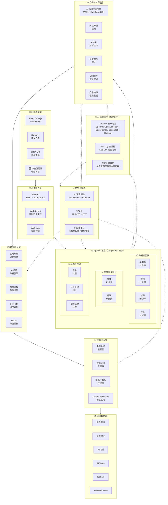

### 分层说明

| 层 | 职责 | 核心组件 | 关键约束 |
|----|------|----------|----------|
| **横切 AI 模型网关** | 多模型统一路由、API Key 管理、故障转移 | LiteLLM, Key Manager | 模型切换实时生效 (AI-006) |
| **L1 外部数据源** | 原始金融数据提供方 | 6 大来源，按分组冗余 | 被动调用，不做处理 |
| **L2 数据接入层** | 多源统一、故障转移、校验、消息队列 | Adapter Pattern, Kafka/RabbitMQ | 故障切换 <2s (DS-001)，含社交媒体适配器 |
| **L3 数据服务层** | 业务级数据处理与分析、按需数据获取 | 热点追踪、AI 趋势分析、研报分析、Serenity、数据按需拉取 | 行情缓存 <3s (DS-002)，K线按需获取 (DS-005) |
| **L3.5 AI 分析结论层** | 🆕 对所有分析结果生成 AI 文字结论 | AI 结论生成引擎、结构化 Markdown 输出 | 覆盖 5+ 分析场景 (AC-001~AC-005) |
| **L4 Agent 引擎层** | 多智能体协作决策管线 | LangGraph 编排，8+ Agent | 单 Agent 响应 <30s (NF-001) |
| **L5 API 网关层** | 统一接入、WebSocket 推送、认证 | FastAPI + JWT | REST + WS 双通道 |
| **L6 前端展示层** | 用户交互、可视化、AI 模型配置管理 | React/Vue.js + Streamlit + 模型配置UI | 行情刷新 5s-60s (NF-002) |

---

## 3. 多源数据适配器架构

### 3.1 数据源优先级与故障转移

6 个数据源按优先级分两组：`cn_stock`（中国A股主力）和 `global_stock`（国际股票兜底）。同一分组内按优先级自动级联尝试，确保高可用。

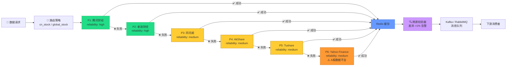

### 3.2 数据流时序

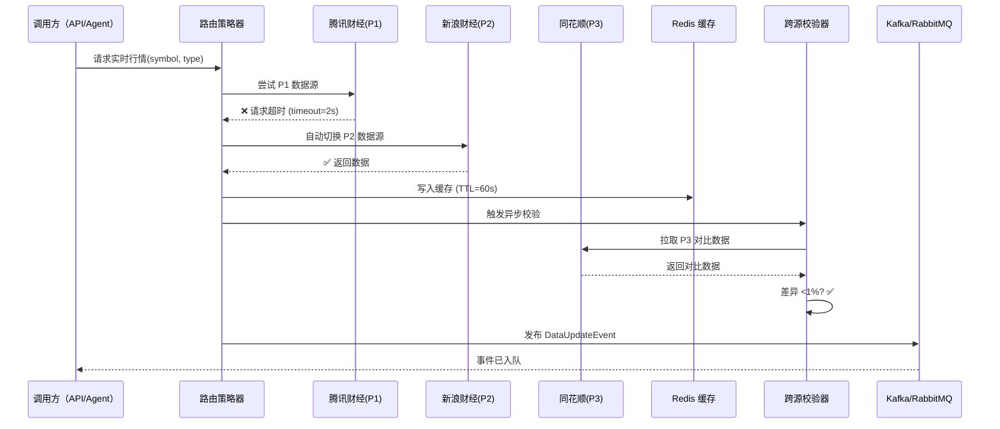

### 3.3 数据源支持矩阵

| 数据类型 | 腾讯 | 新浪 | 同花顺 | AkShare | Tushare | Yahoo |
|----------|:----:|:----:|:------:|:-------:|:-------:|:-----:|
| K线(日/周/月) | ✅ | ✅ | ✅ | ✅ | ✅ | ✅ |
| 实时报价 | ✅ | ✅ | ✅ | ✅ | — | ✅ |
| 财务数据(基本面) | ✅ | — | ✅ | ✅ | ✅ | ✅ |
| 新闻资讯 | — | ✅ | — | ✅ | — | — |
| 板块/指数 | ✅ | — | — | — | — | — |
| 宏观经济 | — | — | — | ✅ | — | — |
| 分钟K线 | ✅ | ✅ | ✅ | ✅ | ✅ | — |

### 3.4 数据存储策略：按需获取 + 关注列表缓存 🆕

**设计原则**：不本地存储全部5000+只股票的历史K线数据，分析时按需从网上数据源实时获取，大幅减少本地/云数据库存储消耗。

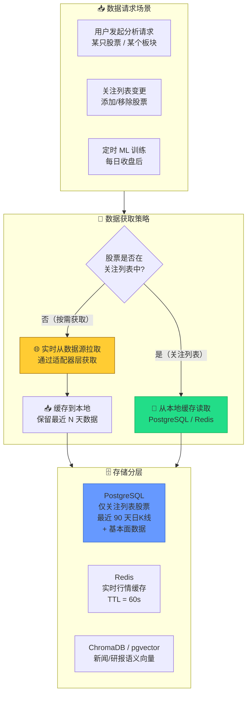

| 数据类别 | 存储策略 | 存储位置 | 保留范围 |
|----------|----------|----------|----------|
| **关注列表股票 K线** | 本地持久化 | PostgreSQL | 最近 90 天日K线（用于技术指标计算和 AI 趋势分析） |
| **实时行情（全部股票）** | 实时拉取 + 短期缓存 | Redis | TTL 60s，仅当前会话 |
| **历史K线（非关注股票）** | **不存储**，按需拉取 | — | 分析时实时从数据源获取 |
| **基本面/财务数据** | 关注列表持久化 | PostgreSQL | 最近 4 个季度 |
| **新闻/研报文本** | 持久化 + 向量化 | PostgreSQL + ChromaDB/pgvector | 新闻 72h，研报长期 |
| **技术指标缓存** | 计算后缓存 | Redis | TTL 随 K线数据刷新 |
| **AI 模型配置** | 持久化 + 热缓存 | PostgreSQL + Redis | 长期保留 |

> **关键收益**：
> - 数据库存储从 ~50GB（5000+只×2年K线）降至 ~500MB（用户关注50-100只×90天）
> - 无需 TimescaleDB，统一使用 PostgreSQL，降低运维复杂度
> - 更适合 Supabase 免费层额度（500MB 数据库）
> - 非关注股票的首次分析延迟稍高（需实时拉取），但后续可临时缓存

---

## 4. AI 模型接入配置管理子系统 🆕

### 4.1 设计理念

系统通过 **LiteLLM 统一网关** 实现对多平台大模型的统一接入，用户在 UI 界面配置模型参数后，Agent 引擎和 AI 分析结论引擎通过统一接口调用，无需关心底层模型差异。

### 4.2 模型网关架构

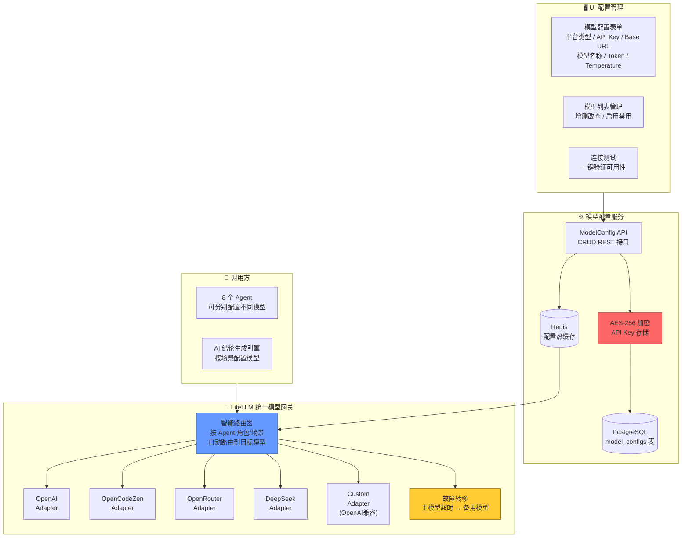

### 4.3 模型配置数据模型

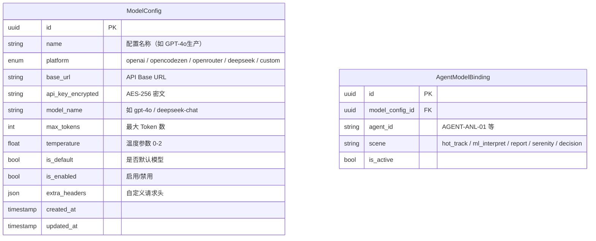

### 4.4 模型配置 API

| 端点 | 方法 | 说明 |
|------|------|------|
| `/api/v1/models` | GET | 获取所有模型配置列表 |
| `/api/v1/models` | POST | 新增模型配置 |
| `/api/v1/models/{id}` | PUT | 更新模型配置 |
| `/api/v1/models/{id}` | DELETE | 删除模型配置 |
| `/api/v1/models/{id}/test` | POST | 测试模型连接（返回延迟+可用状态） |
| `/api/v1/models/{id}/default` | PUT | 设为默认模型 |
| `/api/v1/agent-bindings` | GET/PUT | 管理 Agent/场景 → 模型绑定 |

### 4.5 支持平台一览

| 平台 | 代表模型 | Base URL | 特点 |
|------|---------|----------|------|
| **OpenAI** | gpt-4o, gpt-4o-mini, o1, o3-mini | `https://api.openai.com/v1` | 综合能力最强 |
| **OpenCodeZen** | opencodezen-v1 | 用户配置 | 代码生成优化，适合量化策略编写和回测脚本生成 |
| **OpenRouter** | claude-sonnet-4, gemini-2.5-pro, llama-4 | `https://openrouter.ai/api/v1` | 聚合网关，一键接入多模型 |
| **DeepSeek** | deepseek-chat, deepseek-reasoner | `https://api.deepseek.com/v1` | 国产高性价比 |
| **Custom** | 任意 OpenAI 兼容模型 | 用户自定义 | 最大灵活性 |

### 4.6 需求覆盖

| 需求 ID | 描述 | 实现方式 |
|---------|------|----------|
| AI-001 | 4+ 平台支持 | LiteLLM Adapter 模式，5 类平台适配器 |
| AI-002 | 完整配置项 | UI 表单 + PostgreSQL 存储 |
| AI-003 | 多模型并存 + 按角色路由 | AgentModelBinding 绑定表 |
| AI-004 | API Key 加密 | AES-256 加密存储 + 前端脱敏展示 |
| AI-005 | 连接测试 | `/test` 端点，返回延迟和状态 |
| AI-006 | 切换实时生效 | Redis 热缓存 + 配置变更事件通知 |
| AI-007 | 自定义模型 | Custom Adapter 兼容 OpenAI 格式 |

---

## 5. 实时热点追踪子系统

### 5.1 子系统架构

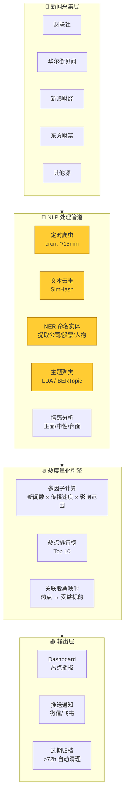

### 5.2 热点量化公式

```
热度指数 = W1 × (新闻数量/基准量) + W2 × (传播速率) + W3 × (影响股票市值覆盖度)
其中：W1=0.4, W2=0.35, W3=0.25
```

### 5.3 需求覆盖

| 需求 ID | 描述 | 实现方式 |
|---------|------|----------|
| HT-001 | 5+ 新闻源覆盖 | 财联社/华尔街见闻/新浪/东方财富/同花顺 |
| HT-002 | NLP 热点提取 | BERTopic 主题聚类 + NER 命名实体 |
| HT-003 | 15min 更新热度 | 定时爬虫 + 增量计算 |
| HT-004 | 72h 自动归档 | TTL 策略，过期新闻移入冷存储 |

> 🆕 热点数据会流入 AI 分析结论引擎，由 AI 生成热点事件摘要和操作建议（AC-001）。

---

## 6. AI 趋势分析子系统 🔄

> **v1.3 重大变更**：股价趋势分析不再使用传统机器学习模型（LSTM/GRU/Transformer），改为通过 **AI 大模型** 分析技术指标和K线形态来判断趋势。减少计算资源消耗，与 AI 模型网关深度集成。

### 6.1 设计理念

系统不自行训练预测模型，而是将K线数据、技术指标（MACD、RSI、KDJ、布林带、均线等）、量价关系等作为上下文，传入 AI 大模型，由 AI 综合分析后输出趋势判断。技术指标计算使用 **TA-Lib** 库完成，计算结果作为 AI 分析的输入。

### 6.2 趋势分析流程

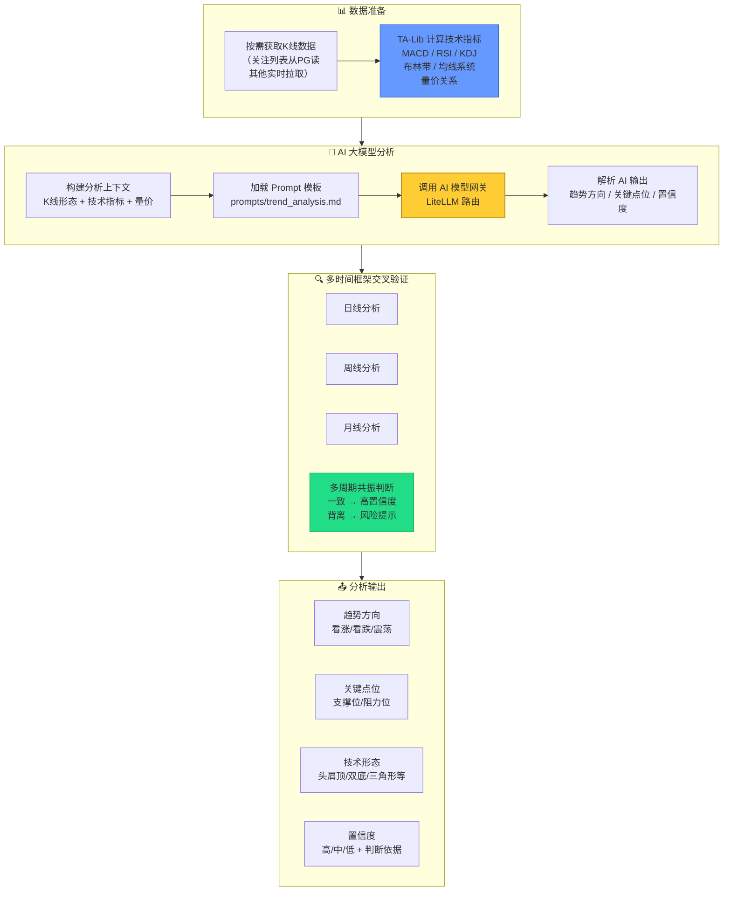

### 6.3 技术指标覆盖

| 指标类别 | 具体指标 | 用途 |
|----------|---------|------|
| 趋势指标 | MA(5/10/20/60)、MACD | 判断趋势方向和强度 |
| 震荡指标 | RSI、KDJ、CCI | 识别超买超卖 |
| 波动指标 | 布林带、ATR | 判断波动区间和突破 |
| 量价指标 | OBV、量比、换手率 | 验证趋势可信度 |
| 形态识别 | 头肩顶/底、双底/顶、三角形、旗形 | AI 识别经典形态 |

### 6.4 AI 趋势分析 Prompt 示例

```text
你是一位专业的技术分析师。请基于以下数据进行分析：

## K线数据（最近20个交易日）
[日K线 OHLCV 数据表格]

## 技术指标
- MA5: xx.xx, MA10: xx.xx, MA20: xx.xx, MA60: xx.xx
- MACD: DIF=xx, DEA=xx, 柱状=xx (金叉/死叉)
- RSI(14): xx (超买/超卖/正常)
- KDJ: K=xx, D=xx, J=xx
- 布林带: 上轨=xx, 中轨=xx, 下轨=xx (价格位置)
- 成交量: 最近5日均量=xx, 量比=xx

## 请输出：
1. 趋势判断（看涨/看跌/震荡）及置信度（高/中/低）
2. 关键支撑位和阻力位
3. 识别到的技术形态
4. 判断依据（列举2-3个关键技术信号）
5. 风险提示
```

### 6.5 时间粒度支持

| 粒度 | 适用场景 | 推荐模型 |
|------|----------|----------|
| 5 分钟 | 日内超短线 | gpt-4o-mini / deepseek-chat |
| 15 分钟 | 日内短线 | gpt-4o-mini / deepseek-chat |
| 30 分钟 | 日内波段 | gpt-4o-mini / deepseek-chat |
| 1 小时 | 日内趋势 | gpt-4o / deepseek-chat |
| 1 天 | 隔日趋势 | gpt-4o / deepseek-chat |
| 周/月线 | 中长期趋势 | o1 / deepseek-reasoner |

### 6.6 需求覆盖

| 需求 ID | 描述 | 实现方式 |
|---------|------|----------|
| TA-001 | AI 趋势方向 + 关键点位 | K线数据 + TA-Lib 指标 → AI 模型网关分析 |
| TA-002 | 5 种时间粒度 | 参数化配置，不同粒度传入不同周期K线 |
| TA-003 | 置信度 + 判断依据 | Prompt 要求 AI 输出置信度和信号依据 |
| TA-004 | 多周期交叉验证 | 日/周/月线并行分析 → 共振/背离判断 |
| TA-005 | 模型可配置 | 通过 AgentModelBinding 配置趋势分析场景模型 |

---

## 7. 机构研报分析子系统

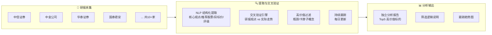

### 需求覆盖

| 需求 ID | 描述 | 实现方式 |
|---------|------|----------|
| IR-001 | 10+ 券商覆盖 | 自动爬虫 + API |
| IR-002 | NLP 结构化提取 | BERT NER + 模板匹配 |
| IR-003 | 交叉验证过滤 | 研报预测 vs 实际价格走势对比 |
| IR-004 | Top5 高价值筛选 | 瓶颈稀缺性评分模型 |
| IR-005 | 持续跟踪 | 每日定时更新跟踪报告 |

---

## 8. Serenity 深度分析子系统

### 8.1 五步分析流程

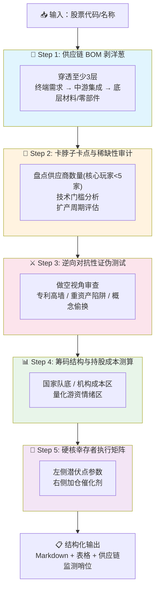

### 8.2 瓶颈筛选三条件

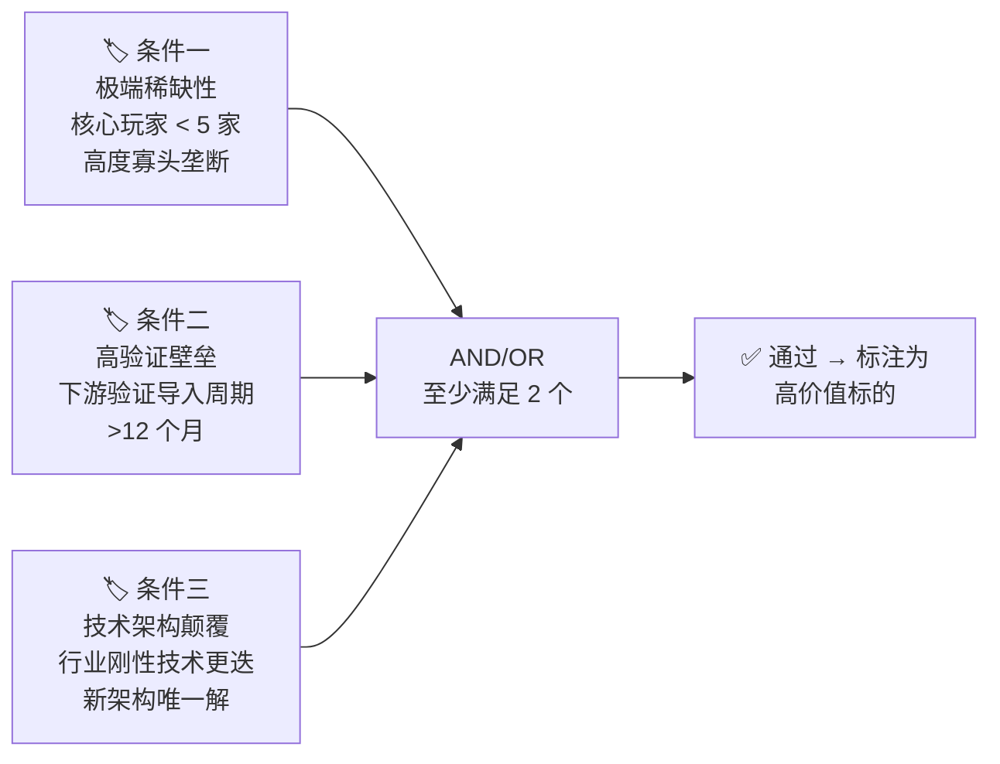

### 8.3 需求覆盖

| 需求 ID | 描述 | 实现方式 |
|---------|------|----------|
| SA-001 | 5 步自动串联 | LangGraph StateGraph 编排 |
| SA-002 | 结构化输出 | Markdown 模板 + 动态表格生成 |
| SA-003 | 三条件瓶颈筛选 | 规则引擎 + NLP 辅助判断 |

---

## 9. AI 分析结论生成子系统 🆕

### 9.1 设计理念

所有数据采集和分析完成后，由 AI 大模型对结果进行综合分析，生成结构化、可读性强的文字结论。结论引擎通过 **AI 模型网关** 调用配置好的大模型，不同分析场景可配置使用不同模型（如热点分析用 gpt-4o-mini 降低成本，Serenity 深度分析用 o1 提升质量）。

### 9.2 结论生成流程

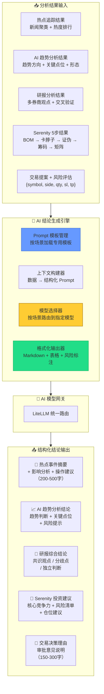

### 9.3 场景与 Prompt 模板映射

| 场景 | Prompt 模板 | 推荐模型 | 输出长度 |
|------|------------|----------|----------|
| 热点追踪分析 | `prompts/hot_topic_analysis.md` | gpt-4o-mini / deepseek-chat | 200-500字 |
| AI 趋势分析 | `prompts/trend_analysis.md` | gpt-4o-mini / deepseek-chat | 200-400字 |
| 研报综合结论 | `prompts/report_synthesis.md` | gpt-4o / deepseek-chat | 300-800字 |
| Serenity 投资建议 | `prompts/serenity_advice.md` | o1 / deepseek-reasoner | 500-1000字 |
| 交易决策理由 | `prompts/trade_rationale.md` | gpt-4o / deepseek-chat | 150-300字 |

### 9.4 结论输出格式规范

所有 AI 结论统一输出为结构化 Markdown：

```markdown
## 📊 AI 分析结论

### 🔍 核心发现
- 关键发现 1
- 关键发现 2

### 📈 数据支撑
| 指标 | 数值 | 评级 |
|------|------|------|
| ... | ... | 🟢/🟡/🔴 |

### ⚠️ 风险提示
- 🔴 高风险：...
- 🟡 中风险：...
- 🟢 低风险：...

### 💡 操作建议
- 建议方向：...
- 参考仓位：...
- 关键点位：...
```

### 9.5 需求覆盖

| 需求 ID | 描述 | 实现方式 |
|---------|------|----------|
| AC-001 | 热点分析结论 | Prompt 模板 + AI 模型网关 |
| AC-002 | AI 趋势分析结论 | K线+指标 → AI 综合分析 |
| AC-003 | 研报综合结论 | 多文档交叉对比 Prompt |
| AC-004 | Serenity 投资建议 | 5 步结果聚合分析 |
| AC-005 | 交易决策理由 | 提案→理由生成 |
| AC-006 | 结构化输出 | Markdown 模板引擎 |
| AC-007 | 场景模型配置 | AgentModelBinding + 模型选择器 |

---

## 10. 财经大V观点聚合子系统 🆕

### 10.1 设计理念

系统自动采集抖音和微博平台前 20 名财经大V近 48 小时内发布的内容，通过 AI 提取核心观点、多空方向和推荐标的，在资讯页面统一展示。该子系统作为多源信息的补充维度，帮助用户了解主流财经自媒体的市场看法，并可与系统内其他分析结果进行交叉验证。

### 10.2 子系统架构

```mermaid
flowchart TB
    subgraph 数据采集["📱 社交媒体数据采集层"]
        direction LR
        douyin["抖音 API<br/>财经大V Top 20"]
        weibo["微博 API<br/>财经大V Top 20"]
    end

    subgraph 数据处理["🧠 数据处理管道"]
        crawler_kv["定时采集器<br/>cron: */30min"]
        dedup_kv["去重引擎<br/>跨平台重复过滤"]
        nlp_kv["NLP 观点提取<br/>NER + 情感分析"]
        ranking_kv["大V 排行榜<br/>动态维护"]
    end

    subgraph AI分析["🤖 AI 增强分析"]
        opinion_extract["AI 观点摘要<br/>提取核心观点 ≤150字"]
        direction_detect["多空方向识别<br/>看多/看空/中性"]
        stock_link_kv["标的提取<br/>股票代码 + 板块"]
        consensus["AI 聚合分析<br/>共识/分歧摘要"]
    end

    subgraph 存储["💾 存储层"]
        pg_kv[("PostgreSQL<br/>大V观点持久化<br/>保留 30 天")]
        redis_kv[("Redis<br/>热度缓存<br/>TTL 30min")]
        vector_kv[("向量库<br/>观点语义索引")]
    end

    subgraph 输出["📤 前端展示"]
        feed["资讯页双列卡片<br/>抖音/微博分列展示"]
        filter["筛选器<br/>按平台/热度/时间"]
        detail["观点详情展开<br/>原文链接跳转"]
        cross["交叉对比<br/>vs 趋势分析/研报"]
    end

    数据采集 --> 数据处理
    数据处理 --> AI分析
    AI分析 --> 存储
    存储 --> 输出

    style crawler_kv fill:#fc3,stroke:#960
    style nlp_kv fill:#fc3,stroke:#960
    style opinion_extract fill:#69f,stroke:#36c
    style consensus fill:#2d8,stroke:#1a5
```

### 10.3 数据模型

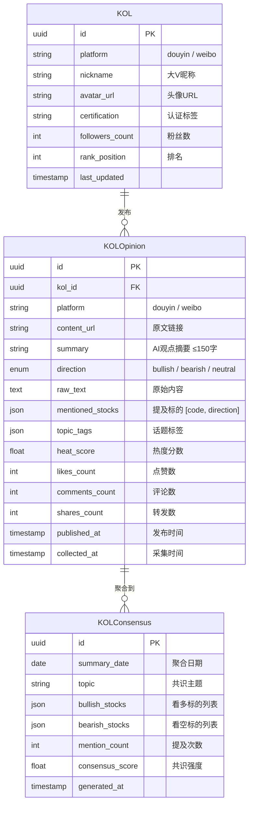

### 10.4 热度计算公式

```
大V观点热度 = W1 × ln(点赞数+1) + W2 × ln(评论数+1) + W3 × ln(转发数+1) + W4 × 大V影响力系数
其中：W1=0.25, W2=0.30, W3=0.20, W4=0.25
大V影响力系数 = ln(粉丝数) / ln(最大粉丝数)，归一化到 [0,1]
```

### 10.5 大V排行榜管理

| 管理维度 | 说明 |
|----------|------|
| **初始榜单** | 系统预置抖音/微博各 20 名财经大V，基于公开粉丝数据 |
| **动态调整** | 每周自动评估大V活跃度和内容质量，调整排名 |
| **手动管理** | 管理员可通过后台添加/移除大V、调整排名 |
| **去重机制** | 同一大V跨平台账号自动关联，避免重复统计 |

### 10.6 时效与存储策略

| 数据类型 | 存储策略 | 保留时间 |
|----------|----------|:--------:|
| 大V观点原文 | 持久化存储 | 30 天 |
| AI 观点摘要 | 持久化存储 | 长期 |
| 热度数据 | Redis 缓存 | TTL 30min |
| 聚合共识 | 持久化存储 | 长期 |
| **前端展示** | **仅展示 48h 内观点** | 过期自动隐藏 |

### 10.7 AI 结论覆盖 🆕

大V观点聚合结果会流入 **AI 分析结论引擎**（第 9 章），生成：
- 每日大V共识/分歧摘要（AC-008）
- 热议标的交叉对比报告（vs 趋势分析、研报结论）

### 10.8 需求覆盖

| 需求 ID | 描述 | 实现方式 |
|---------|------|----------|
| KV-001 | 抖音+微博 Top 20 大V 48h观点采集 | 定时爬虫 + 平台 API |
| KV-002 | 来源/身份/时间/热度标注 | 数据模型字段 + UI 卡片展示 |
| KV-003 | AI 多空方向 + 标的提取 | NLP NER + AI 模型网关分析 |
| KV-004 | 资讯页双列展示 + 筛选排序 | 前端卡片列表 + 筛选器组件 |
| KV-005 | AI 共识/分歧聚合 + 交叉对比 | AI 聚合分析 + 多维度对比引擎 |

---

## 11. 多智能体协作架构（核心）

### 11.1 Agent 角色关系与消息流

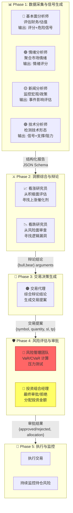

### 11.2 五阶段协作时序

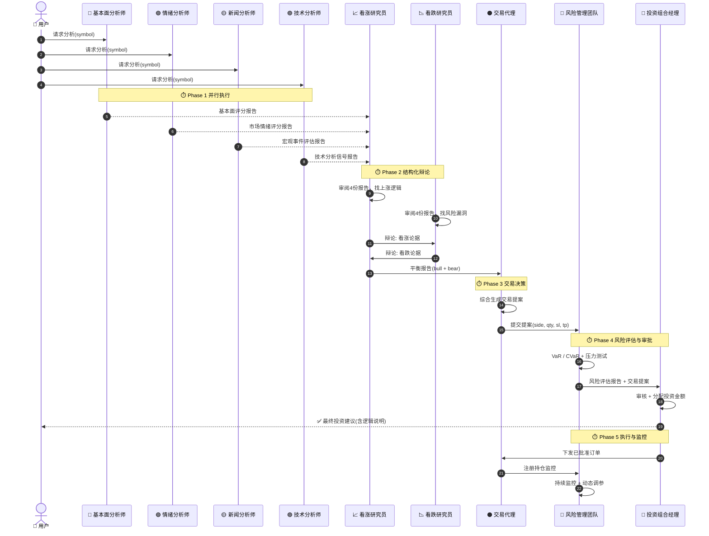

### 11.3 Agent 间消息协议设计

Agent 间通信采用**结构化 JSON 消息协议**，严禁自然语言自由通信，确保消息可解析、可追踪、可审计。

```json
{
  "message_id": "uuid-v4",
  "timestamp": "2026-06-16T14:30:00Z",
  "source_agent": "AGENT-ANL-01",
  "target_agent": "AGENT-RES-01",
  "message_type": "FUNDAMENTAL_ANALYSIS_REPORT",
  "payload": {
    "symbol": "000001.SZ",
    "name": "平安银行",
    "scores": {
      "pe_ratio_score": 0.72,
      "pb_ratio_score": 0.65,
      "roe_score": 0.85,
      "debt_ratio_score": 0.60,
      "overall": 0.71
    },
    "red_flags": [],
    "intrinsic_value_range": { "low": 12.5, "high": 15.3 },
    "confidence": 0.82
  },
  "schema_version": "1.0.0",
  "correlation_id": "session-uuid"
}
```

消息 Schema 定义在 `shared/schemas/` 目录，包含以下类型：

| Schema 文件 | 说明 |
|-------------|------|
| `fundamental_report.json` | 基本面分析报告 |
| `sentiment_report.json` | 情绪分析报告 |
| `news_impact_report.json` | 新闻影响评估 |
| `technical_signal.json` | 技术分析信号 |
| `debate_conclusion.json` | 辩论结论 |
| `trade_proposal.json` | 交易提案 |
| `risk_assessment.json` | 风险评估报告 |
| `approval_decision.json` | 审批决策 |

---

## 12. 技术栈全景图

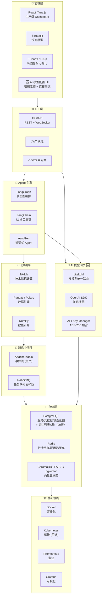

### 技术选型理由

| 技术 | 选型理由 |
|------|----------|
| **Python 3.11+** | AI/ML 生态最完善，LangChain/LangGraph 原生支持 |
| **LangGraph** | 支持有状态的 DAG 编排，天然适合 5 阶段 Agent 工作流 |
| **LiteLLM** 🆕 | 多模型统一网关，支持 OpenAI/DeepSeek/OpenRouter 等 100+ LLM 统一 API 调用；同时承载 AI 趋势分析 |
| **FastAPI** | 高性能异步 Python Web 框架，原生 WebSocket 支持 |
| **PostgreSQL** | 通用关系型数据库，存储业务数据 + 关注列表K线（90天），无需额外时序数据库 |
| **Redis** | 低延迟缓存，适合实时行情（按需拉取后缓存60s）、模型配置热缓存和速率限制 |
| **Kafka** | 高吞吐事件流，适合行情数据广播和 Agent 事件驱动 |
| **ChromaDB / FAISS / pgvector** | 轻量级向量数据库，适合新闻/研报的语义检索 |
| **TA-Lib** 🔄 | 技术指标计算库，计算 MACD/RSI/布林带等指标作为 AI 趋势分析的输入 |

---

## 13. 部署架构

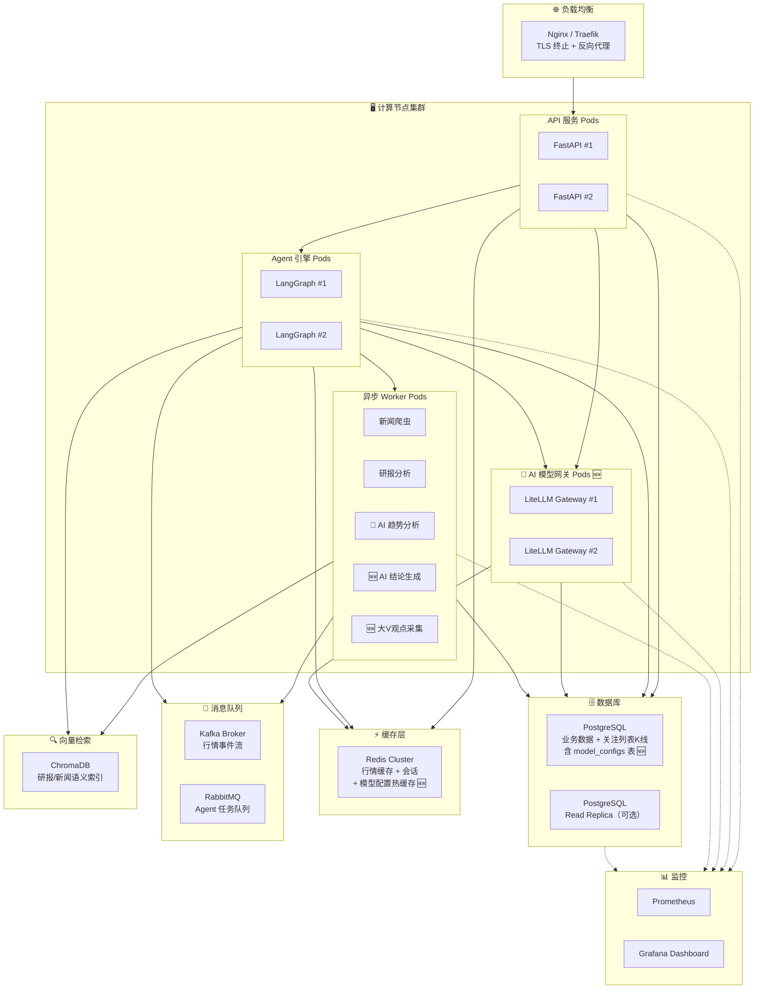

### 部署规格建议

| 组件 | CPU | 内存 | 存储 | 实例数 |
|------|-----|------|------|--------|
| FastAPI | 2 vCPU | 4 GB | — | 2+ |
| LangGraph Agent | 4 vCPU | 8 GB | — | 2+ |
| **LiteLLM Gateway** 🆕 | 2 vCPU | 4 GB | — | 2+ |
| **AI Trend Worker** 🔄 | 2 vCPU | 4 GB | — | 1+ |
| **AI Conclusion Worker** 🆕 | 2 vCPU | 4 GB | — | 1+ |
| **KOL Crawler Worker** 🆕 | 1 vCPU | 2 GB | — | 1 |
| PostgreSQL | 2 vCPU | 4 GB | 20 GB SSD | 1（关注列表数据量小） |
| Redis | 2 vCPU | 4 GB | 20 GB SSD | 1 |
| Kafka | 4 vCPU | 16 GB | 500 GB SSD | 3 |

---

## 14. 关键技术决策与权衡

### 14.1 决策记录

| # | 决策点 | 选择 | 备选方案 | 理由 |
|---|--------|------|----------|------|
| 1 | Agent 编排框架 | **LangGraph** | CrewAI, AutoGen | 有状态 DAG + 人工审批节点，最适合 5 阶段工作流 |
| 2 | 消息队列 | **Kafka (生产)** / **RabbitMQ (开发)** | Redis Streams | Kafka 高吞吐适合行情事件，RabbitMQ 更易本地开发 |
| 3 | **历史K线存储** 🆕 | **按需获取 + 关注列表缓存** | 全量本地存储 (TimescaleDB) | 5000+只全量存储成本高，按需拉取即可满足分析需求 |
| 4 | **股价趋势分析** 🔄 | **AI 大模型分析** | 自训 LSTM/GRU/Transformer | 无需GPU训练、零维护、分析可解释性强、与AI模型网关统一 |
| 5 | 前端框架 | **React (生产)** / **Streamlit (原型)** | Vue.js | React 生态最成熟，Streamlit 适合快速验证 |
| 6 | 向量数据库 | **ChromaDB / pgvector** | Pinecone, Milvus | 轻量级，适合嵌入部署，无需外部服务；pgvector 可直接在 PG 内使用 |
| 7 | **AI 模型网关** 🆕 | **LiteLLM** | 自建路由层 | 支持 100+ LLM 统一 API，社区活跃，原生支持 OpenAI/DeepSeek/OpenRouter |
| 8 | **模型配置存储** 🆕 | **PostgreSQL + Redis 热缓存** | 配置文件 / Vault | PG 存储结构化配置，Redis 缓存实现切换实时生效 |
| 9 | **大V观点采集** 🆕 | **定时爬虫 + AI 增强** | 人工录入 / 纯爬虫 | 定时采集 + AI 自动提取观点，兼顾时效性和结构化 |

### 14.2 扩展路线图

```mermaid
flowchart LR
    v1["v1.0 核心功能<br/>MVP 验证"] --> v2["v1.5 增强"]
    v2 --> v3["v2.0 成熟"]

    subgraph v1["🎯 v1.0 — MVP"]
        mv1["多源数据 + 故障转移"]
        mv2["4 个分析师 Agent"]
        mv3["Serenity 5 步分析"]
        mv4["研究辩论 + 交易决策"]
        mv5["🆕 AI 模型配置管理"]
        mv6["🆕 AI 分析结论生成"]
    end

    subgraph v2["🚀 v1.5 — 增强"]
        v15_1["机构研报分析"]
        v15_2["实时热点 Dashboard"]
        v15_3["回测引擎"]
        v15_4["多周期趋势联动分析"]
        v15_5["🆕 大V观点聚合"]
    end

    subgraph v3["🌟 v2.0 — 成熟"]
        v20_1["模拟交易"]
        v20_2["实盘接入"]
        v20_3["微信/飞书通知"]
        v20_4["多账户管理"]
    end
```

---

## 附录 A: 需求覆盖矩阵

| 需求分类 | P0 需求 | P1 需求 | 覆盖率 |
|----------|:------:|:------:|:------:|
| 数据源 | DS-001 ~ DS-005 | — | 100% |
| 热点追踪 | HT-001 ~ HT-004 | — | 100% |
| Serenity 分析 | SA-001 ~ SA-003 | — | 100% |
| **AI 趋势分析** 🔄 | TA-001 ~ TA-005 | — | 100% |
| **用户关注列表** 🆕 | WL-001 ~ WL-005 | — | 100% |
| 分析师团队 | AGENT-ANL-(01-04) | — | 100% |
| 研究辩论 | AGENT-RES-(01-02) | — | 100% |
| 交易代理 | AGENT-TRD-01 | — | 100% |
| 风险与审批 | AGENT-RSK-01, AGENT-PM-01 | — | 100% |
| **AI 模型配置** 🆕 | AI-001 ~ AI-007 | — | 100% |
| **AI 分析结论** 🆕 | AC-001 ~ AC-007 | — | 100% |
| 非功能需求 | NF-001 ~ NF-015 | — | 100% |
| 机构研报 | — | IR-001 ~ IR-005 | 100% |
| **大V观点聚合** 🆕 | — | KV-001 ~ KV-005 | 100% |

---

> **文档维护**：本文档随架构演进持续更新，请以最新版本为准。  
> **版本历史**：v1.0 (初版) → v1.1 (新增 AI 模型配置 + AI 分析结论) → v1.2 (按需数据获取，移除 TimescaleDB) → v1.3 (ML预测改为AI大模型趋势分析，移除 PyTorch/TF/ONNX) → v1.3.1 (需求文档重构为PRD，新增关注列表+非功能需求扩展) → v1.4.0 (新增财经大V观点聚合子系统)  
> **参考文件**：`ai_requirement.yaml`、`Serenity分析法.md`、`需求文档.md`
