# AI 股票分析平台 — 产品需求文档 (PRD)

> **项目代号**：AI Stock Analysis Platform  
> **文档版本**：v1.4.0  
> **最后更新**：2026-06-17  
> **优先级**：高 | **状态**：草稿  
> **参考文件**：`ai_requirement.yaml` / `系统架构文档.md` / `Serenity分析法.md`

---

## 目录

1. [项目概述](#1-项目概述)
2. [目标用户](#2-目标用户)
3. [功能需求](#3-功能需求)
   - [F1. 多源数据接入与故障转移](#f1-多源数据接入与故障转移)
   - [F2. 实时热点追踪播报](#f2-实时热点追踪播报)
   - [F3. AI 趋势分析与预测](#f3-ai-趋势分析与预测)
   - [F4. 机构研报自动分析与验证](#f4-机构研报自动分析与验证)
   - [F5. Serenity 深度股票分析](#f5-serenity-深度股票分析)
   - [F6. 多智能体协作决策系统](#f6-多智能体协作决策系统)
   - [F7. AI 模型接入配置管理](#f7-ai-模型接入配置管理)
   - [F8. AI 分析结论自动生成](#f8-ai-分析结论自动生成)
   - [F9. 用户关注列表管理](#f9-用户关注列表管理)
   - [F10. 前端展示与交互](#f10-前端展示与交互)
   - [F11. 财经大V观点聚合](#f11-财经大v观点聚合)
4. [非功能需求](#4-非功能需求)
5. [数据存储策略](#5-数据存储策略)
6. [推荐技术栈](#6-推荐技术栈)
7. [优先级划分](#7-优先级划分)
8. [版本规划](#8-版本规划)
9. [附录：功能依赖关系](#9-附录功能依赖关系)

---

## 1. 项目概述

### 1.1 项目背景

个人投资者在信息获取和分析深度上相比机构存在显著差距。本项目旨在构建一个**基于多智能体架构的 AI 股票分析系统**，为个人投资者提供机构级别的深度分析能力。

### 1.2 核心价值主张

| 能力维度 | 传统个人投资者 | 本系统 |
|----------|:------------:|:------:|
| 数据源 | 单一 App / 网站 | 6 源自动故障转移 |
| 趋势分析 | 人工看图 | AI 大模型多周期分析 |
| 研报获取 | 碎片化浏览 | 自动采集 + 交叉验证 |
| 深度分析 | 无体系 | Serenity 瓶颈猎头框架 |
| 决策流程 | 单人主观判断 | 8 Agent 多角色协作 |

### 1.3 核心特色

- **多源数据自动切换**：6 大金融数据源按优先级级联尝试，故障自动转移
- **AI 大模型趋势分析**：不自行训练 ML 模型，通过大模型分析技术指标和K线形态
- **机构研报交叉验证**：自动获取研报后与市场实际走势对比，不盲信研报结论
- **Serenity 瓶颈猎头分析法**：5 步穿透供应链，寻找"卡脖子"咽喉标的
- **多模型 AI 接入**：UI 配置支持 OpenAI / DeepSeek / OpenRouter 等多平台
- **多 Agent 协作决策**：8 个专业角色分工，5 阶段结构化工作流
- **财经大V观点聚合**：抖音+微博 Top 100 大V 48h 观点，AI 提取多空方向与交叉验证

---

## 2. 目标用户

| 用户类型 | 描述 | 核心需求 |
|----------|------|----------|
| **个人投资者** | 有一定股票投资经验，需要专业级分析工具的散户 | 深度分析报告、趋势判断、风险提示 |
| **量化交易者** | 需要数据源和分析管线的程序化交易者 | 稳定数据源、可配置 AI 模型、API 接入 |
| **投资研究员** | 需要快速扫描大量股票和研报的半专业研究者 | 研报聚合、多维度对比、供应链穿透 |

---

## 3. 功能需求

### F1. 多源数据接入与故障转移

**优先级**：P0（必须） | **需求编号**：DS-001 ~ DS-005

#### F1.1 数据源覆盖

系统接入以下 6 大金融数据源，按优先级自动选择：

| 优先级 | 数据源 | 可靠性 | 数据类型 | 故障转移组 |
|:------:|--------|:------:|----------|:----------:|
| P1 | 腾讯财经 | 高 | K线 / 实时报价 / 指数 / 基本面 | cn_stock |
| P2 | 新浪财经 | 高 | K线 / 实时报价 / 新闻 | cn_stock |
| P3 | 同花顺 | 中 | K线 / 实时报价 / 基本面 | cn_stock |
| P4 | AkShare | 中 | K线 / 基本面 / 新闻 / 宏观 | cn_stock |
| P5 | Tushare | 中 | K线 / 基本面 / 参考数据 | cn_stock |
| P6 | Yahoo Finance | 中 | K线 / 实时报价 / 基本面 | global_stock |

#### F1.2 故障转移机制

- 同一分组内按优先级自动级联尝试
- 单个数据源请求失败后 **< 2 秒**自动切换下一源
- 故障转移对用户完全透明，无感知

#### F1.3 数据时效性要求

| 数据类型 | 时效要求 |
|----------|----------|
| 实时行情 | 延迟 < 3 秒 |
| 新闻资讯 | 发布时间 < 72 小时 |
| K线数据 | 按需实时拉取 |

#### F1.4 数据一致性校验

- 跨数据源对比同一股票同一时间段 K线数据
- 差异 > 1% 时自动记录告警

#### F1.5 数据按需获取策略

**核心原则**：不本地存储全部 5000+ 只股票的历史K线数据，分析时按需从数据源实时拉取。

| 数据类型 | 存储策略 | 存储位置 | 保留范围 |
|----------|----------|----------|----------|
| 关注列表股票 K线 | 本地持久化 | PostgreSQL | 最近 90 天日K线 |
| 实时行情（全部股票） | 实时拉取 + 短期缓存 | Redis | TTL 60s |
| 非关注股票历史K线 | **不存储**，按需拉取 | — | 分析时实时获取 |
| 基本面/财务数据 | 关注列表持久化 | PostgreSQL | 最近 4 个季度 |
| 新闻/研报文本 | 持久化 + 向量化 | PostgreSQL + 向量库 | 新闻 72h，研报长期 |
| 大V观点/原文 | 持久化 + 向量化 | PostgreSQL + 向量库 | 原文 30 天，AI 摘要长期 |

**收益**：数据库存储从 ~50GB 降至 ~500MB，无需额外时序数据库。

---

### F2. 实时热点追踪播报

**优先级**：P0（必须） | **需求编号**：HT-001 ~ HT-004

#### F2.1 新闻采集

自动抓取以下权威金融新闻源（至少 5 个）：
- 财联社、华尔街见闻、新浪财经、东方财富、同花顺等

#### F2.2 热点识别与量化

- 使用 NLP 从新闻中提取热点主题、热度和关联股票
- 热点识别准确率 > 80%，关联股票正确率 > 70%
- **每 15 分钟**更新一次热点排行榜

#### F2.3 热度计算

```
热度指数 = 0.4 × (新闻数量/基准量) + 0.35 × (传播速率) + 0.25 × (影响股票市值覆盖度)
```

#### F2.4 时效管理

- 展示资讯均在 **72 小时**内
- 过期信息自动归档

---

### F3. AI 趋势分析与预测

**优先级**：P0（必须） | **需求编号**：TA-001 ~ TA-005

#### F3.1 分析方式

**不自行训练传统机器学习模型（LSTM/GRU/Transformer 等）**。将 K线数据、技术指标、量价关系作为上下文传入 AI 大模型，由 AI 综合分析并输出趋势判断。

#### F3.2 技术指标覆盖

使用 **TA-Lib** 库计算以下指标作为 AI 分析输入：

| 指标类别 | 具体指标 | 用途 |
|----------|---------|------|
| 趋势指标 | MA(5/10/20/60)、MACD | 判断趋势方向和强度 |
| 震荡指标 | RSI、KDJ、CCI | 识别超买超卖 |
| 波动指标 | 布林带、ATR | 判断波动区间和突破 |
| 量价指标 | OBV、量比、换手率 | 验证趋势可信度 |
| 形态识别 | 头肩顶/底、双底/顶、三角形、旗形 | AI 识别经典形态 |

#### F3.3 时间粒度支持

| 粒度 | 适用场景 |
|------|----------|
| 5 分钟 | 日内超短线 |
| 15 分钟 | 日内短线 |
| 30 分钟 | 日内波段 |
| 1 小时 | 日内趋势 |
| 1 天 | 隔日趋势 |
| 周/月线 | 中长期趋势 |

#### F3.4 多周期交叉验证

- 同时分析**日线、周线、月线**
- AI 判断多周期是否共振
- 一致 → 高置信度；背离 → 风险提示

#### F3.5 输出要求

每次分析必须包含：
1. 趋势方向判断（看涨/看跌/震荡）
2. 关键支撑位和阻力位
3. 技术形态识别
4. 置信度评估（高/中/低）及判断依据
5. 风险提示

#### F3.6 模型配置

趋势分析通过 AI 模型网关调用，可独立配置使用的模型（如日常用 deepseek-chat 降成本，深度分析用 o1）。

---

### F4. 机构研报自动分析与验证

**优先级**：P1（重要） | **需求编号**：IR-001 ~ IR-005

#### F4.1 研报采集

- 自动获取主流券商研报（覆盖至少 **10 家**）：中金、中信、华泰、国泰君安等
- NLP 结构化提取：核心观点、推荐股票、目标价、评级
- 提取准确率 > 85%

#### F4.2 交叉验证（核心原则）

**不能直接相信研报结论**。必须：
- 将研报推荐与股票/行业实际走势进行对比
- 过滤掉与市场实际走势不符的推荐
- 对每个推荐股票生成独立分析报告

#### F4.3 高价值标的筛选

- 按瓶颈/卡脖子概念评分过滤
- 输出 **Top 5** 高价值标的及筛选逻辑

#### F4.4 持续跟踪

- 覆盖标的每日自动更新跟踪报告

---

### F5. Serenity 深度股票分析

**优先级**：P0（必须） | **需求编号**：SA-001 ~ SA-003

#### F5.1 概述

输入一个股票代码或名称，启动基于 **Serenity 瓶颈猎头投研框架**的完整 5 步分析流程。

#### F5.2 五步分析流程

| 步骤 | 名称 | 内容 |
|:----:|------|------|
| 1 | 供应链 BOM 剥洋葱 | 将市场热点穿透至少 3 层，从终端需求到中游集成到底层材料/零部件 |
| 2 | 卡脖子卡点与稀缺性审计 | 盘点供应商数量、技术门槛、扩产周期 |
| 3 | 逆向对抗性证伪测试 | 做空机构视角审查：专利高墙/重资产陷阱/概念偷换 |
| 4 | 筹码结构与持股成本测算 | 国家队底/机构成本区/量化游资情绪区 |
| 5 | 硬核幸存者执行矩阵 | 左侧潜伏点参数 + 右侧加仓催化剂 |

#### F5.3 瓶颈筛选三条件

标的必须满足以下**至少 2 项**硬性条件：

1. **极端稀缺性**：核心玩家 < 5 家，高度寡头垄断
2. **高验证壁垒**：下游验证导入周期 > 12 个月
3. **技术架构颠覆**：行业迎来刚性技术更迭，该组件是新架构唯一解

#### F5.4 输出格式

- 结构化 Markdown（标题 + 分级列表 + 横向对比表格）
- 每份报告包含至少 1 个对比表格
- 结尾给出下阶段核心供应链跟踪监测哨位

---

### F6. 多智能体协作决策系统

**优先级**：P0（必须） | **需求编号**：AGENT-ANL-01 ~ AGENT-PM-01

#### F6.1 概述

将复杂交易任务分解为 **8 个专业 AI Agent 角色**，通过 **5 阶段结构化工作流**协作完成。

#### F6.2 角色体系

##### 分析师团队（4 个 Agent）

| Agent | 角色 | 输入 | 输出 |
|-------|------|------|------|
| 🔵 基本面分析师 | 评估公司财务和绩效指标 | 财务报表、估值指标、行业对比 | 基本面评分、危险信号列表、内在价值估算 |
| 🟢 情绪分析师 | 聚合市场情绪 | 新闻标题、社交媒体、社区讨论 | 市场情绪评分、情绪趋势 |
| 🟡 新闻分析师 | 监控全球新闻和宏观经济 | 全球金融新闻、宏观数据、政策公告 | 事件影响评估、宏观评分 |
| 🟣 技术分析师 | 检测交易模式和形态 | K线数据、成交量、技术指标 | 技术分析信号、支撑/阻力位、形态识别 |

##### 研究辩论团队（2 个 Agent）

| Agent | 角色 |
|-------|------|
| 📈 看涨研究员 | 从积极面评估，寻找上涨催化剂 |
| 📉 看跌研究员 | 从风险面审查，寻找逻辑漏洞 |

对分析师团队的洞察进行**结构化学术辩论**，在潜在收益与固有风险之间取得平衡。

##### 决策与审批团队（2 个 Agent）

| Agent | 角色 | 关键职责 |
|-------|------|----------|
| 🟠 交易代理 | 综合报告做出交易决策 | 确定交易时机和规模、制定买卖建议、设定止盈止损 |
| 🔴 风险管理团队 | 评估投资组合风险 | VaR/CVaR 计算、持仓集中度、压力测试、策略参数调整 |
| 👑 投资组合经理 | 最终审批/拒绝 | 审核交易提案、分配投资金额、批准后给出投资逻辑说明 |

#### F6.3 五阶段工作流

```
Phase 1: 数据采集与信号生成  →  4 个分析师并行工作
    ↓
Phase 2: 洞察综合与辩论      →  看涨 vs 看跌研究员辩论
    ↓
Phase 3: 交易决策生成        →  交易代理生成交易提案
    ↓
Phase 4: 风险评估与审批      →  风险管理 + 投资组合经理最终决策
    ↓
Phase 5: 执行与监控          →  执行已批准交易 + 持续监控
```

#### F6.4 通信协议规范

Agent 间通信必须使用**结构化 JSON Schema 消息协议**，严禁自然语言自由通信：

- 消息包含：`message_id`（UUID）、`source_agent`、`target_agent`、`message_type`、`payload`、`schema_version`、`correlation_id`
- 消息 Schema 定义在 `shared/schemas/` 目录
- 支持的消息类型：基本面报告、情绪报告、新闻评估、技术信号、辩论结论、交易提案、风险评估、审批决策

---

### F7. AI 模型接入配置管理

**优先级**：P0（必须） | **需求编号**：AI-001 ~ AI-007

#### F7.1 概述

在 UI 界面提供 AI 大模型接入的配置管理功能，支持多种主流大模型平台的接入与切换。

#### F7.2 支持的平台

| 平台 | 代表模型 | 特点 |
|------|---------|------|
| **OpenAI** | gpt-4o, gpt-4o-mini, o1, o3-mini | 综合能力最强 |
| **OpenCodeZen** | opencodezen-v1 | 代码生成优化 |
| **OpenRouter** | claude-sonnet-4, gemini-2.5-pro, llama-4 | 聚合网关，一键接入多模型 |
| **DeepSeek** | deepseek-chat, deepseek-reasoner | 国产高性价比 |
| **Custom** | 任意 OpenAI 兼容模型 | 最大灵活性 |

#### F7.3 配置项

每个模型配置包含：
- 平台类型（下拉选择）
- API Base URL（支持自定义代理地址）
- API Key（**AES-256 加密存储**，前端脱敏展示）
- 模型名称（如 `gpt-4o`, `deepseek-chat`）
- 最大 Token 数
- 温度参数 (Temperature)
- 是否设为默认模型
- 启用/禁用开关

#### F7.4 关键特性

| 特性 | 说明 |
|------|------|
| **增删改查** | UI 界面完整 CRUD 操作 |
| **连接测试** | 一键验证模型可用性，返回延迟和状态 |
| **多模型并存** | 可配置多个模型，不同 Agent 角色使用不同模型 |
| **实时生效** | 模型切换无需重启服务 |
| **自定义兼容** | 支持任意兼容 OpenAI API 格式的第三方模型 |

#### F7.5 平台推荐使用场景

| 平台 | 推荐使用场景 | 说明 |
|------|-------------|------|
| **OpenAI** | 基本面分析、最终决策 | 综合能力强，适合财务评估和审批决策 |
| **DeepSeek** | 情绪分析、趋势分析 | 国产高性价比，适合高频调用场景 |
| **OpenCodeZen** | 代码生成、策略脚本 | 代码优化能力强，适合量化策略编写和回测脚本生成 |
| **OpenRouter** | 深度分析、复杂推理 | 可接入 Claude/Gemini 等最强模型 |
| **Custom** | 私有化部署 | 支持企业内部模型或特殊需求 |

---

### F8. AI 分析结论自动生成

**优先级**：P0（必须） | **需求编号**：AC-001 ~ AC-007

#### F8.1 概述

在数据采集完成后，由 AI 大模型对收集到的数据进行综合分析，生成结构化的详细分析结论，覆盖所有分析场景。

#### F8.2 覆盖场景

| 场景 | AI 结论内容 | 输出长度 |
|------|------------|----------|
| 实时热点追踪 | 热点事件摘要、影响分析、关联标的推荐、操作建议 | 200-500 字 |
| AI 趋势分析 | 趋势判断、关键点位、技术形态解读、风险提示 | 200-400 字 |
| 研报综合结论 | 共识观点、分歧点、独立判断、推荐理由 | 300-800 字 |
| Serenity 投资建议 | 核心竞争力总结、风险清单、投资时间窗口、仓位建议 | 500-1000 字 |
| 多 Agent 决策 | 交易提案决策理由、审批意见说明 | 150-300 字 |

#### F8.3 输出格式规范

所有 AI 结论统一为结构化 Markdown：
- 标题层级分明
- 包含数据表格
- 风险标注（🔴 高 / 🟡 中 / 🟢 低）
- 要点列表清晰

#### F8.4 模型配置

不同分析场景可独立配置使用的 AI 模型（如热点分析用 gpt-4o-mini 降成本，Serenity 深度分析用 o1 提质量）。

---

### F9. 用户关注列表管理

**优先级**：P0（必须） | **新增**

#### F9.1 功能说明

用户可创建和维护个人股票关注列表，关注列表中的股票享受本地缓存加速。

#### F9.2 核心能力

| 功能 | 说明 |
|------|------|
| 添加/移除股票 | 支持代码或名称搜索添加 |
| 分组管理 | 支持自定义分组（如"科技"、"消费"、"自选"） |
| 快速分析入口 | 关注列表内一键启动深度分析 |
| 缓存加速 | 关注股票 K线本地缓存 90 天，读取 < 500ms |
| 批量操作 | 支持批量导入/导出关注列表 |

---

### F10. 前端展示与交互

**优先级**：P1（重要） | **新增**

#### F10.1 核心页面

| 页面 | 功能 |
|------|------|
| **Dashboard** | 市场概览、热点播报、自选股行情 |
| **AI 模型配置** | 模型增删改查、连接测试、Agent 绑定 |
| **大V观点** | 抖音+微博 Top 100 财经大V 48h观点、AI共识摘要、交叉对比 |
| **深度分析** | 股票搜索 → Serenity 5 步分析 → 结论展示 |
| **研报中心** | 研报列表、综合结论、跟踪报告 |
| **趋势分析** | 多周期趋势图、AI 分析结论、技术指标面板 |
| **Agent 决策** | 交易提案查看、审批流程、历史记录 |

#### F10.2 关键交互

- 行情刷新频率：5s-60s 可配置
- 实时行情通过 WebSocket 推送
- K线图表交互（缩放、切换周期、叠加指标）

---

### F11. 财经大V观点聚合

**优先级**：P1（重要） | **需求编号**：KV-001 ~ KV-005

#### F11.1 概述

自动获取抖音、微博平台**前 20 名财经大V**近 2 天内发布的观点和推荐，在资讯页面统一展示。帮助用户快速了解主流财经自媒体对市场的看法和推荐方向，作为多源信息交叉验证的一环。

#### F11.2 数据源

| 平台 | 采集对象 | 采集频率 |
|------|----------|:--------:|
| **抖音** | 财经类 Top 20 博主（按粉丝数/影响力排序） | 每 30 分钟 |
| **微博** | 财经类 Top 20 大V（按粉丝数/活跃度排序） | 每 30 分钟 |

> **大V 筛选标准**：粉丝数 > 50 万 + 财经领域认证 + 近 7 天有更新。排行榜由系统动态维护，支持手动调整。

#### F11.3 采集内容

| 字段 | 说明 |
|------|------|
| **大V 身份** | 平台 + 昵称 + 认证标签（如「财经博主」「CFA持证人」） |
| **发布时间** | 精确到分钟 |
| **观点摘要** | AI 提取核心观点（不超过 150 字） |
| **推荐标的** | 明确提及的股票/板块（含方向：看多/看空） |
| **话题标签** | 关联热点话题 |
| **话题热度** | 基于点赞/评论/转发量计算 |
| **原文链接** | 可跳转查看原文 |

#### F11.4 展示要求

- 在资讯页面以**双列卡片列表**展示，左侧抖音、右侧微博，或按时间线混合排序
- 每条观点卡片包含：**来源平台图标 + 博主头像/昵称 + 认证标签 + 发布时间 + 观点摘要 + 推荐标的 + 热度指示**
- 支持按平台筛选、按热度排序、按发布时间排序
- 支持点击展开查看完整内容
- **时效过滤**：默认仅展示**近 2 天（48 小时）**内的观点，过期内容自动隐藏

#### F11.5 AI 增强

- AI 自动提取观点中的**多空方向**和**推荐标的**
- AI 对 Top 20 大V 观点进行**聚合分析**，生成共识/分歧摘要
- 支持将大V 推荐标的与系统其他分析结果（趋势分析、研报等）进行**交叉对比**
- 当多个大V 同时提及同一标的时，自动标记为「🔥 热议标的」

---

## 4. 非功能需求

### 4.1 性能

| 编号 | 需求 | 目标 |
|:----:|------|------|
| NF-001 | Agent 分析响应时间 | p95 < 30s |
| NF-002 | 实时行情刷新频率 | 5s-60s 可配置 |
| NF-003 | 系统可用性（交易时段） | > 99.5% |
| NF-004 | 数据源故障切换时间 | < 2s |
| NF-005 | 关注列表 K线读取 | < 500ms |
| NF-006 | 非关注股票首次分析延迟 | < 5s |

### 4.2 可扩展性

| 编号 | 需求 | 目标 |
|:----:|------|------|
| NF-007 | Agent 角色可插拔 | 新增一个 Agent < 1 人天 |
| NF-008 | 数据源适配器模式 | 新增数据源 < 0.5 人天 |
| NF-009 | AI 模型平台扩展 | 新增平台通过 Custom Adapter 零代码接入 |

### 4.3 安全性

| 编号 | 需求 | 目标 |
|:----:|------|------|
| NF-010 | API Key 加密存储 | AES-256 |
| NF-011 | 前端 API Key 展示 | 脱敏格式（如 `sk-****xxxx`） |
| NF-012 | 用户认证 | JWT 令牌认证 |

### 4.4 可维护性

| 编号 | 需求 | 目标 |
|:----:|------|------|
| NF-013 | Agent 间通信 | 结构化 JSON Schema，非自然语言 |
| NF-014 | 消息 Schema 管理 | 集中在 `shared/schemas/` 目录 |
| NF-015 | 日志与监控 | Prometheus + Grafana 可观测 |

---

## 5. 数据存储策略

### 5.1 核心原则

**不本地存储全部 5000+ 只股票的历史K线**，分析时按需从网上数据源实时获取。仅对用户关注列表中的股票缓存关键数据。

### 5.2 存储分层

| 数据类别 | 存储策略 | 存储位置 | 保留范围 |
|----------|----------|----------|----------|
| 关注列表股票 K线 | 本地持久化 | PostgreSQL | 最近 90 天日K线 |
| 实时行情（全部） | 实时拉取 + 短期缓存 | Redis | TTL 60s |
| 非关注股票 K线 | **不存储**，按需拉取 | — | 分析时实时获取 |
| 基本面/财务数据 | 关注列表持久化 | PostgreSQL | 最近 4 个季度 |
| 新闻/研报文本 | 持久化 + 向量化 | PostgreSQL + 向量库 | 新闻 72h，研报长期 |
| 技术指标缓存 | 计算后缓存 | Redis | TTL 随 K线刷新 |
| 大V观点/原文 | 持久化 + 向量化 | PostgreSQL + 向量库 | 原文 30 天，AI 摘要长期 |
| AI 模型配置 | 持久化 + 热缓存 | PostgreSQL + Redis | 长期保留 |

### 5.3 收益

- 数据库存储：~50GB → ~500MB（降低 100 倍）
- 无需 TimescaleDB，统一 PostgreSQL
- 适配 Supabase 等免费层额度

---

## 6. 推荐技术栈

| 层级 | 技术 | 说明 |
|------|------|------|
| **语言** | Python 3.11+ | AI/数据科学生态最完善 |
| **Agent 框架** | LangGraph + LangChain | 有状态 DAG 编排，天然适合多阶段工作流 |
| **AI 模型网关** | LiteLLM | 100+ LLM 统一 API 路由 |
| **API 框架** | FastAPI | 高性能异步，原生 WebSocket |
| **数据库** | PostgreSQL | 业务数据 + 关注列表 K线 |
| **缓存** | Redis | 实时行情 + 配置热缓存 |
| **消息队列** | Kafka (生产) / RabbitMQ (开发) | 事件驱动架构 |
| **向量数据库** | ChromaDB / pgvector | 新闻/研报语义检索 |
| **技术指标** | TA-Lib | MACD/RSI/布林带等技术指标计算 |
| **数据处理** | Pandas / Polars | 数据清洗与转换 |
| **前端** | React / Vue.js (生产) / Streamlit (原型) | Dashboard 与可视化 |
| **数据源库** | akshare / tushare / yfinance | 金融数据获取 |
| **监控** | Prometheus + Grafana | 可观测性 |

---

## 7. 优先级划分

### P0 — 必须实现（MVP）

- ✅ 多源数据接入与故障转移（DS-001 ~ DS-005）
- ✅ 实时热点追踪播报（HT-001 ~ HT-004）
- ✅ AI 趋势分析与预测（TA-001 ~ TA-005）
- ✅ Serenity 深度股票分析（SA-001 ~ SA-003）
- ✅ 多智能体协作决策系统（AGENT-ANL-01 ~ AGENT-PM-01）
- ✅ AI 模型接入配置管理（AI-001 ~ AI-007）
- ✅ AI 分析结论自动生成（AC-001 ~ AC-007）
- ✅ 用户关注列表管理（F9）
- ✅ 所有非功能需求（NF-001 ~ NF-015）

### P1 — 重要（v1.5 实现）

- ⬜ 机构研报自动分析与验证（IR-001 ~ IR-005）
- ⬜ 前端 Dashboard 完整实现（F10）
- ⬜ 财经大V观点聚合（KV-001 ~ KV-005）

### P2 — 锦上添花（v2.0 实现）

- ⬜ 微信/飞书消息推送通知
- ⬜ 回测引擎（历史交易模拟）
- ⬜ 模拟交易（Paper Trading）
- ⬜ 多账户管理
- ⬜ 实盘交易接入

---

## 8. 版本规划

```mermaid
flowchart LR
    v1["v1.0 MVP<br/>核心分析能力"] --> v15["v1.5 增强<br/>研报+前端"]
    v15 --> v2["v2.0 成熟<br/>通知+实盘"]

    subgraph v1["🎯 v1.0"]
        m1["多源数据 + 故障转移"]
        m2["4 分析师 Agent"]
        m3["Serenity 5 步分析"]
        m4["研究辩论 + 决策审批"]
        m5["AI 模型配置管理"]
        m6["AI 结论自动生成"]
        m7["AI 趋势分析"]
        m8["关注列表管理"]
    end

    subgraph v15["🚀 v1.5"]
        e1["机构研报分析"]
        e2["热点 Dashboard"]
        e3["回测引擎"]
        e4["多周期趋势联动"]
        e5["大V观点聚合"]
    end

    subgraph v2["🌟 v2.0"]
        e5["模拟交易"]
        e6["实盘接入"]
        e7["微信/飞书通知"]
        e8["多账户管理"]
    end
```



---

## 9. 附录：功能依赖关系

```
外部数据源（L1）
    │
    ├──→ 多源数据适配器（L2）────→ 所有上层功能
    │
    ├──→ AI 模型配置管理 ────→ 所有 AI 分析功能
    │
    ├──→ 实时热点追踪（L3）
    │       └──→ AI 分析结论生成
    │
    ├──→ AI 趋势分析（L3）
    │       └──→ AI 分析结论生成
    │
    ├──→ 机构研报分析（L3）
    │       └──→ AI 分析结论生成
    │
    ├──→ Serenity 深度分析（L3）
    │       └──→ AI 分析结论生成
    │
    └──→ 分析师团队（L4）
            └──→ 研究辩论团队
                    └──→ 交易代理
                            └──→ 风险管理团队
                                    └──→ 投资组合经理（最终审批）
```

---

> **文档维护**：本文档随项目演进持续更新，请以最新版本为准。  
> **变更记录**：  
> - v1.0 (2026-06-16) — 初始版本，8 项核心功能  
> - v1.1 (2026-06-17) — 新增 AI 模型配置管理 + AI 分析结论生成  
> - v1.2 (2026-06-17) — 数据存储策略改为按需获取 + 关注列表缓存，移除 TimescaleDB  
> - v1.3 (2026-06-17) — ML 预测改为 AI 大模型趋势分析，移除 PyTorch/TF/ONNX；**重构为专业 PRD 格式，补充 7 项缺失需求**  
> - v1.4 (2026-06-17) — 新增 F11 财经大V观点聚合（抖音+微博 Top 100）
